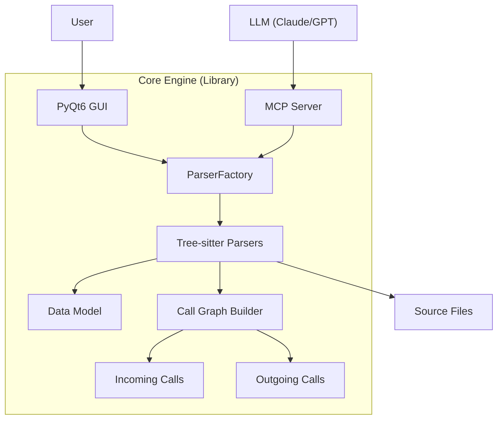

# Code-Context-Bridge v4.1

Tree-sitter 기반 다중 언어 소스 코드 분석 도구. PyQt6 GUI와 MCP 서버를 통해 코드 구조, 심볼, 함수 호출 관계를 시각화하고 AI 에이전트에게 제공합니다.

## 1. 프로젝트 개요 (Overview)

**Code-Context-Bridge**는 Tree-sitter 파서를 사용하여 Python, JavaScript, TypeScript, Java, C++, C#, Go, Rust, Vue, Svelte 등 10개 언어의 소스 코드를 파싱하고, 다음 기능을 제공합니다:

1. **PyQt6 GUI 애플리케이션** (`main_gui.py`)
   - 파일 트리 뷰어와 심볼 트리 뷰어
   - 실시간 심볼 검색 (현재 파일 / 프로젝트 전체)
   - Call Graph 시각화 (Incoming/Outgoing 함수 호출 관계)
   - 프로젝트 인덱싱 및 진행 상황 표시

2. **MCP 서버** (`main_mcp.py`)
   - Claude/GPT 등 AI 에이전트를 위한 Model Context Protocol 인터페이스
   - 프로젝트 구조 조회, 심볼 검색, 코드 스켈레톤 추출, 전체 코드 읽기 기능 제공
   - stdio 방식으로 실행 (FastMCP 라이브러리 사용)

**핵심 기술 스택:**
- Tree-sitter: 다중 언어 파싱 엔진
- PyQt6: GUI 프레임워크
- FastMCP: MCP 프로토콜 구현
- Python 3.x

**설치 방법:**
```bash
pip install -r requirements.txt
```

**참고:** Vue와 Svelte 파서는 PyPI에 공식 패키지로 제공되지 않을 수 있습니다. 자세한 내용은 [6. 지원 언어 및 파일 확장자](#6-지원-언어-및-파일-확장자) 섹션을 참고하세요.

---

## 2. 시스템 아키텍처 (System Architecture)

핵심 파싱 로직을 공유 라이브러리 형태로 분리하여 GUI와 MCP 서버가 공유한다.



### 2.1 디렉토리 구조 (Directory Structure)
```
/
├── main_gui.py            # [EntryPoint] 사람용 GUI (v4.1: Call Graph UI 추가)
├── main_mcp.py            # [EntryPoint] AI용 MCP 서버
├── core/                  # [Shared] 핵심 로직 (GUI 의존성 없음)
│   ├── parser_factory.py
│   ├── call_graph.py      # [v4.1] 함수 호출 관계 추적
│   ├── parsers/
│   │   ├── base_parser.py
│   │   └── tree_sitter_parser.py  # [v4.1] extract_calls() 메서드 추가
│   └── symbol_node.py
├── utils/
│   ├── logger.py          # Stream(Console) + File Logging
│   └── file_utils.py      # 공통 파일 읽기 유틸리티 (다중 인코딩 지원)
└── logs/                  # 실행 로그 저장
```

---

## 3. 핵심 기능 명세 (Feature Specifications)

### 3.1 로깅 시스템 (Real-time Console Logging)
*   **Dual Output:** 모든 로그는 `logs/debug.log` 파일과 `CMD Console(StreamHandler)`에 동시에 출력되어야 한다.
*   **목적:** 개발자가 실행 중인 파싱 상태, 에러 발생 파일, 검색 쿼리 처리 현황을 실시간으로 모니터링.

### 3.2 심볼 검색 (Symbol Search) - GUI 전용
*   **UI:** 메인 윈도우 상단에 검색 바(Search Bar) 배치.
*   **Logic (Recursive Filter):**
    *   사용자 입력 시 실시간(또는 엔터 입력 시) 트리 필터링.
    *   검색어와 일치하는 노드(Node)는 강조 표시.
    *   **Rule:** 자식 노드가 매칭되면 부모 노드는 접히지 않고(Expanded) 보여야 함. 매칭되지 않는 노드는 숨김(Hidden).
*   **검색 범위:** "Current File" (현재 파일 내 심볼만) 또는 "Entire Project" (프로젝트 전체 검색)

### 3.3 Call Graph 기능 (v4.1) - GUI 전용
*   **Incoming References (호출자):** 선택한 함수/메서드를 호출하는 모든 함수들을 트리 구조로 표시
*   **Outgoing References (호출 대상):** 선택한 함수/메서드 내부에서 호출하는 모든 함수들을 트리 구조로 표시
*   **인덱싱:** 프로젝트 열기 시 자동으로 Call Graph 구축 (진행 상황 표시)
*   **네비게이션:** Call Graph 아이템 클릭 시 해당 파일/라인으로 자동 이동
*   **순환 참조 방지:** 재귀적 탐색 시 최대 깊이 제한(max_depth=10) 및 방문 노드 추적
*   **지원 파일 형식:** `.py`, `.js`, `.ts`, `.java`, `.cpp`, `.c`, `.cs`, `.go`, `.vue`, `.svelte`, `.cu`, `.cuh` (Call Graph 구축 대상)
*   **스니펫 표시:** 각 호출 위치의 코드 스니펫을 툴팁으로 제공

---

## 4. MCP 서버 통합 (MCP Server Integration) - AI 전용

AI 에이전트가 로컬 프로젝트를 직접 분석할 수 있도록 표준 MCP 프로토콜을 구현한다.
초기엔 로컬(Stdio)로 구현하고, 추후 웹(SSE) 확장을 고려하여 **FastMcp** (Python SDK)를 사용한다.

### 4.1 제공 도구 (Exposed Tools)
AI에게 제공할 함수(Tools) 목록:

1.  **`get_project_structure(path: Optional[str] = None, depth: int = 2)`**
    *   설명: 프로젝트의 폴더 구조와 파일 목록만 빠르게 리턴.
    *   `path`: 프로젝트 루트 경로 (지정하지 않으면 전역 설정 사용)
2.  **`search_symbol(query: str, project_root: Optional[str] = None)`**
    *   설명: 프로젝트 전체에서 특정 함수/클래스 **이름만** 검색. 정확하고 빠른 검색을 위해 이름만 매칭합니다.
    *   `project_root`: 프로젝트 루트 경로 (지정하지 않으면 전역 설정 사용)
3.  **`search_symbol_with_signature(query: str, project_root: Optional[str] = None)`**
    *   설명: 프로젝트 전체에서 심볼 **이름과 시그니처를 모두** 검색. 파라미터 이름 등으로 검색할 때 유용합니다.
    *   주의: 검색 범위가 넓어져 결과가 많을 수 있습니다.
    *   `project_root`: 프로젝트 루트 경로 (지정하지 않으면 전역 설정 사용)
4.  **`read_skeleton(file_path: str)`**
    *   설명: **[핵심]** 파일의 전체 코드를 읽지 않고, `def`, `class` 정의부(Signature)만 추출하여 리턴. (토큰 절약)
5.  **`read_full_code(file_path: str, start_line: int, end_line: int)`**
    *   설명: 스켈레톤을 보고 AI가 특정 구현부가 필요하다고 판단하면, 해당 라인의 실제 코드를 조회.

### 4.2 실행 방식
*   **CLI 명령:** 
    *   `python main_mcp.py` (stdio 방식)
    *   `python main_mcp.py --project-root /path/to/project` (프로젝트 루트 지정)
*   **환경 변수:** `PROJECT_ROOT` 환경 변수로도 프로젝트 루트를 설정할 수 있습니다.
*   **우선순위:** 명령행 인자 > 환경 변수 > 도구 호출 시 파라미터
*   AI 에이전트 설정 파일에 위 명령어를 등록하여 사용.
*   **참고:** 프로젝트 루트가 전역으로 설정되면, 도구 호출 시 `project_root` 파라미터를 생략할 수 있습니다.

---

## 5. 상세 구현 가이드 (Implementation Details)

### 5.1 데이터 모델 (`core/symbol_node.py`)
MCP에서 JSON 직렬화를 위해 `to_dict()` 메서드가 구현되어 있습니다.

**실제 구현:**
```python
@dataclass
class SymbolNode:
    name: str
    kind: str
    start_line: int
    end_line: int
    path: str = ""
    signature: str = ""
    children: List['SymbolNode'] = field(default_factory=list)
    
    def to_dict(self) -> Dict[str, Any]:
        """MCP 응답용 JSON 변환"""
        return {
            "name": self.name,
            "kind": self.kind,
            "path": self.path,
            "range": {
                "start": self.start_line,
                "end": self.end_line
            },
            "signature": self.signature,
            "children": [child.to_dict() for child in self.children]
        }
```

### 5.2 검색 로직 (Filtering Strategy)

**GUI 검색** (`main_gui.py`):
- 현재 파일 검색: `filter_tree_recursive()` - 실시간 트리 필터링, 매칭 노드 강조 표시
- 프로젝트 전체 검색: `perform_global_search()` - `_search_node_recursive()` 사용, 정규식 패턴 매칭
- 검색 대상: 심볼 이름과 시그니처 (`node.name + node.signature`)

**MCP 검색** (`main_mcp.py`):
- `search_symbol()`: `_search_recursive()` 사용 - 심볼 이름만 매칭 (대소문자 무시)
  - 정확하고 빠른 검색에 적합
- `search_symbol_with_signature()`: `_search_recursive_with_signature()` 사용 - 이름과 시그니처 모두 검색
  - 파라미터 이름 등으로 검색할 때 유용하지만 결과가 많을 수 있음

**참고:** 
- GUI는 항상 시그니처까지 검색합니다.
- MCP는 기본적으로 이름만 검색하지만, 필요 시 `search_symbol_with_signature()` 툴을 사용하여 시그니처까지 검색할 수 있습니다.
- LLM은 일반적으로 `search_symbol()`로 시작하고, 필요할 때만 `search_symbol_with_signature()`를 사용하는 것이 효율적입니다.

### 5.3 Call Graph 구축 (v4.1)
프로젝트 전체를 순회하며 함수 호출 관계를 추적하는 시스템.

**구조:**
- `CallGraph` 클래스 (`core/call_graph.py`): 호출 관계를 저장하는 데이터 구조
  - `incoming_calls`: 함수명 → 호출자 리스트 매핑 `[{'path': str, 'caller': str, 'line': int, 'snippet': str}]`
  - `outgoing_calls`: (파일경로, 함수명) 튜플 → 호출 대상 리스트 매핑 `[{'called': str, 'line': int, 'snippet': str}]`
  - `definitions`: 함수명 → 정의 파일 경로 리스트 매핑

**프로세스:**
1. 프로젝트 루트에서 지원되는 소스 파일 수집 (`.py`, `.js`, `.ts`, `.java`, `.cpp`, `.c`, `.cs`, `.go`, `.vue`, `.svelte`, `.cu`, `.cuh`)
2. 각 파일에 대해 `TreeSitterParser.extract_calls()` 실행하여 함수 정의 및 호출 추출
3. 호출 정보를 `CallGraph` 인스턴스에 저장 (메모리 기반)
4. GUI에서 심볼 클릭 시 `call_graph.get_incoming()`, `call_graph.get_outgoing()`으로 정보 조회
5. 재귀적 트리 구축 시 `max_depth=10` 제한 및 `visited` set으로 순환 참조 방지

**제한사항:**
- 동적 호출 (`getattr`, `eval`, `__getattr__` 등)은 추적 불가
- 메서드 체이닝의 일부 케이스에서 정확도 제한
- 대규모 프로젝트에서 메모리 사용량 증가 가능 (모든 호출 정보를 메모리에 저장)
- 경로 정규화 불일치로 인한 일부 호출 정보 누락 가능 (Windows/Unix 경로 차이)

---

## 6. 지원 언어 및 파일 확장자

**파싱 지원 언어 (Tree-sitter 기반):**
- Python: `.py`
- JavaScript: `.js`, `.jsx`
- TypeScript: `.ts`, `.tsx`
- Java: `.java`
- C++: `.cpp`, `.h`
- C#: `.cs`
- Go: `.go`
- Rust: `.rs`
- Vue: `.vue`
- Svelte: `.svelte`
- CUDA: `.cu`, `.cuh`

**Call Graph 구축 대상:**
- Python, JavaScript, TypeScript, Java, C++, C, C#, Go, Vue, Svelte, CUDA (`.py`, `.js`, `.ts`, `.java`, `.cpp`, `.c`, `.cs`, `.go`, `.vue`, `.svelte`, `.cu`, `.cuh`)

**참고사항(추후 AI답변 검토 필요요):**
- **Vue와 Svelte 파서 설치:** `tree-sitter-vue`와 `tree-sitter-svelte` 파서는 PyPI에 공식 패키지로 제공되지 않을 수 있습니다. 이 경우 다음 방법으로 설치할 수 있습니다:
  - 소스에서 빌드: [tree-sitter-vue](https://github.com/ikatyang/tree-sitter-vue), [tree-sitter-svelte](https://github.com/Himujjal/tree-sitter-svelte)
  - 또는 `py-tree-sitter-vue`, `py-tree-sitter-svelte` 패키지가 사용 가능한 경우: `pip install py-tree-sitter-vue py-tree-sitter-svelte`
- **CUDA 파일:** CUDA 파일(`.cu`, `.cuh`)은 C++ 파서(`tree-sitter-cpp`)를 사용하여 파싱됩니다.

## 7. 에이전트 작업 지시 사항 (Instructions for Agent)

1.  **Core Separation First:** `core/` 패키지는 PyQt 의존성 없이 독립적으로 동작해야 합니다. `SymbolNode`와 `BaseParser`는 GUI 없이도 테스트 가능해야 합니다.
2.  **Console Visible:** `utils/logger.py`의 `setup_logger()`가 `StreamHandler`를 통해 콘솔에 로그를 출력하도록 구현되어 있습니다.
3.  **MCP Ready:** `read_skeleton()` 함수는 `_generate_skeleton_string()`을 통해 파일의 클래스/함수 정의부만 추출하여 반환합니다.
4.  **Error Resilience:** `BaseParser._read_file_safe()` 메서드가 UTF-8 인코딩 실패 시 로깅하고 빈 문자열을 반환하여 크래시를 방지합니다.

---


## 7. 주요 LLM 에이전트들의 codebase indexing 기법 참조

- 클로드: https://support.claude.com/en/articles/12386420-claude-code-faq?q=codebase+indexing
- Roo code: https://docs.roocode.com/features/codebase-indexing
- Cursor: https://cursor.com/docs/context/codebase-indexing
